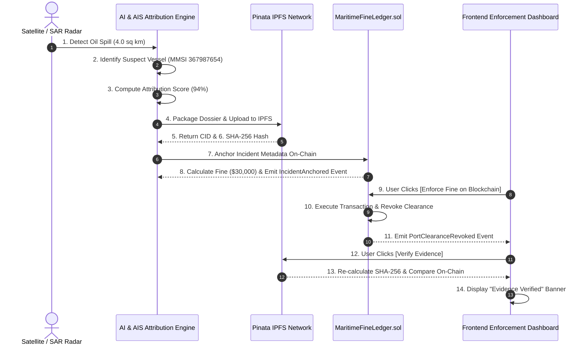

# AegisOcean Blockchain & IPFS Demonstration Guide

> **⚠️ Important Legal & Technical Disclaimer**:  
> This demonstration uses simulated test data and operates on the Polygon Amoy Testnet. The fine calculations, vessel attribution records, and smart contract state changes demonstrated in this project are strictly for technical proof-of-concept purposes and **do not constitute real legal enforcement or binding financial penalties**.

---

## 1. Executive Summary

This guide demonstrates how **AegisOcean** combines AI-powered oil spill detection, IPFS decentralized forensic evidence storage, and Polygon Amoy smart contracts to create a tamper-proof, auditable maritime compliance ledger.

---

## 2. The 15-Step End-to-End Demo Workflow



---

## 3. Quick Start: Running the Demo

### Prerequisites
Make sure dependencies are installed inside the `blockchain` folder:

```bash
cd blockchain
npm install
```

### Command 1: Run the Automated 15-Step CLI Demo
To execute the complete 15-step pipeline in your terminal:

```bash
cd blockchain
npx hardhat run scripts/runDemo.js
```

### Command 2: Run the Full Unit Test Suite (25 Tests)
To verify all smart contracts, IPFS service, backend API routes, and AI adapters:

```bash
cd blockchain
npm test
```

### Command 3: Launch the Express Backend API Server
To start the backend API server for frontend dashboard integration:

```bash
cd blockchain
npm start
```

---

## 4. Interactive Frontend Dashboard Preview

You can preview and test the interactive dashboard component directly in any browser:

1. Locate the file:  
   [`blockchain/components/BlockchainEvidencePanel.html`](file:///c:/Users/Ojaswini/AegisOcean/blockchain/components/BlockchainEvidencePanel.html)
2. Double-click to open in Chrome, Edge, or Firefox.
3. Test the interactive buttons:
   - Click **`🔍 [Verify Evidence]`** to test real-time SHA-256 hash comparison.
   - Click **`⚖️ [Enforce Fine on Blockchain]`** to observe transaction status transitions (`Pending` → `Confirmed` → `PortClearanceRevoked`).

---

## 5. Summary of Demo Outputs & Metrics

| Metric / Parameter | Value / Result |
|---|---|
| **Incident ID** | `#1` |
| **Suspect MMSI** | `367987654` (M/V PACIFIC EAGLE) |
| **Spill Area** | `4.0 sq km` |
| **Attribution Score** | `94% Confidence` |
| **Demonstration Fine** | `$30,000 USD` (Base $10,000 + 4 sq km × $5,000) |
| **IPFS CID** | `Qmd96f987a5cbfd727602a98ddf5ecd608AegisOceanMockCID` |
| **Evidence Hash (SHA-256)** | `0xd96f987a5cbfd727602a98ddf5ecd608eaee48d6e2e97e5d64b28138d1d41692` |
| **Contract Address** | `0x5FbDB2315678afecb367f032d93F642f64180aa3` |
| **Enforcement Event** | `PortClearanceRevoked(incidentId: 1, MMSI: 367987654)` |
| **Verification Status** | `✅ EVIDENCE VERIFIED (Byte-for-byte hash match)` |
| **Polygon Explorer Link** | [https://amoy.polygonscan.com/address/0x5FbDB2315678afecb367f032d93F642f64180aa3](https://amoy.polygonscan.com/address/0x5FbDB2315678afecb367f032d93F642f64180aa3) |
