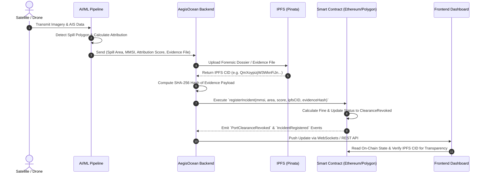

# AegisOcean Blockchain Integration Plan

> **Note for Beginner Developers**: This document explains the existing AegisOcean system, why and how we are introducing blockchain and IPFS, and the step-by-step roadmap for integration without modifying any existing codebase yet.

---

## 1. Overview of the AegisOcean Project

### What is AegisOcean?
**AegisOcean** is an AI-powered maritime environmental safety and compliance platform designed to detect oil spills from satellite imagery/drone surveillance, identify potential suspect ships (using Automatic Identification System - AIS data), calculate attribution confidence scores, and enforce regulatory actions.

### Main Architecture Components:
1. **AI / ML Layer**:
   - Processes satellite radar/optical images to detect oil slick polygons and calculate **Spill Area** (e.g., in km²).
   - Correlates spill timestamps and coordinates with ship tracking (AIS) history to identify the **Suspect Vessel MMSI** (Maritime Mobile Service Identity) and compute an **Attribution Score** (e.g., 88% probability of guilt).
2. **Backend Services (APIs & Database)**:
   - Receives detection alerts from the AI pipeline.
   - Manages incident lifecycle records, user authentication, and system logs in a database (e.g., PostgreSQL / MongoDB).
3. **Frontend Dashboard**:
   - Displays real-time interactive maps, oil spill heatmaps, suspect vessel cards, legal evidence reports, and enforcement actions for port authorities and environmental agencies.

---

## 2. Why Add Blockchain & IPFS?

### The Problem with Traditional Systems:
In traditional centralized databases, incident reports and fine calculations can be altered, deleted, or contested in court by vessel operators claiming data manipulation or corruption.

### The Solution:
1. **Decentralized Storage (IPFS)**: Satellite images and full forensic reports are large (megabytes to gigabytes). Storing large files directly on a blockchain smart contract is extremely expensive. **IPFS (InterPlanetary File System)** stores the large files off-chain and gives us a unique, immutable hash called a **CID (Content Identifier)**.
2. **Blockchain Smart Contract**: We store key metadata (Suspect MMSI, Spill Area, Attribution Score, IPFS CID, Evidence SHA-256 Hash, Fine Amount) on an immutable ledger. Once written, no entity can alter or deny the record.

---

## 3. Breakdown of the 11 Blockchain Requirements

| # | Requirement | Implementation Strategy |
|---|---|---|
| 1 | **Store Incident Information** | Smart contract maintains a `struct Incident` containing timestamp, incident ID, and reporting authority address. |
| 2 | **Store Large Forensic Files on IPFS** | Satellite imagery and PDF forensic dossiers are uploaded to IPFS via Pinata API. |
| 3 | **Store IPFS CID on Blockchain** | The string IPFS CID (`Qm...` or `bafy...`) is saved inside the smart contract `Incident` struct. |
| 4 | **Store Evidence Hash on Blockchain** | Calculate a SHA-256 cryptographic hash of the raw evidence payload and record `bytes32 evidenceHash` on-chain. |
| 5 | **Store Suspect Vessel MMSI** | Store `uint256 suspectMMSI` (9-digit unique maritime ship ID) in the incident record. |
| 6 | **Store Spill Area** | Store `uint256 spillAreaSqMeters` detected by the AI model. |
| 7 | **Store Attribution Score** | Store `uint256 attributionScoreBasisPoints` (e.g., 8500 for 85.00%). |
| 8 | **Calculate Demonstration Fine** | Smart contract calculates fine dynamically: `Fine = BaseRate + (SpillArea * Multiplier * AttributionFactor)`. |
| 9 | **Record Enforcement Status** | Smart contract uses an `enum Status { Reported, UnderReview, ClearanceRevoked, Fined, Resolved }`. |
| 10 | **Emit `PortClearanceRevoked` Event** | Trigger Solidity event `event PortClearanceRevoked(uint256 indexed incidentId, uint256 indexed mmsi, uint256 fineAmount)` when severity exceeds threshold. |
| 11 | **Display Info on Dashboard** | Frontend fetches on-chain status, transaction hash, block number, fine amount, and IPFS link for direct verification. |

---

## 4. End-to-End Data Flow (AI → Backend → IPFS → Blockchain → Frontend)



---

## 5. Technology Stack Selection

- **Smart Contract Language**: Solidity (`^0.8.20`)
- **Development & Testing Framework**: Hardhat or Foundry
- **Storage Service**: IPFS (via Pinata API / Infura IPFS SDK)
- **Blockchain Libraries**: Ethers.js v6 (for Node.js backend & React frontend)
- **Test Network**: Local Hardhat Node / Sepolia Testnet

---

## 6. Future Files to Create (When Implementation Begins)

> **Important**: None of these files will be created until explicitly instructed by you.

```
AegisOcean/
├── contracts/
│   └── AegisOceanEnforcement.sol       # Core Solidity Smart Contract
├── scripts/
│   └── deploy.js                       # Deployment script for local/testnet
├── test/
│   └── AegisOceanEnforcement.test.js  # Smart contract unit tests
├── hardhat.config.js                   # Hardhat network & compiler configuration
├── docs/
│   └── blockchain-plan.md              # [CREATED] This design document
├── backend/
│   ├── services/
│   │   ├── ipfsService.js              # Service to upload files to IPFS
│   │   └── blockchainService.js        # Ethers.js wallet wrapper to send transactions
└── frontend/
    └── src/
        ├── components/
        │   └── BlockchainVerificationCard.jsx # UI component showing Tx Hash & IPFS evidence
        └── hooks/
            └── useBlockchainIncident.js       # React hook for reading smart contract state
```

---

## 7. Next Steps for You (The Developer)

1. **Review this Plan**: Read through `docs/blockchain-plan.md` to ensure it matches your requirements.
2. **Copy Existing Project Files**: If you have an existing codebase or PRD file on your machine, copy the project folder into `c:\Users\Ojaswini\AegisOcean` so we can inspect the exact code structures when you are ready for step 2!
