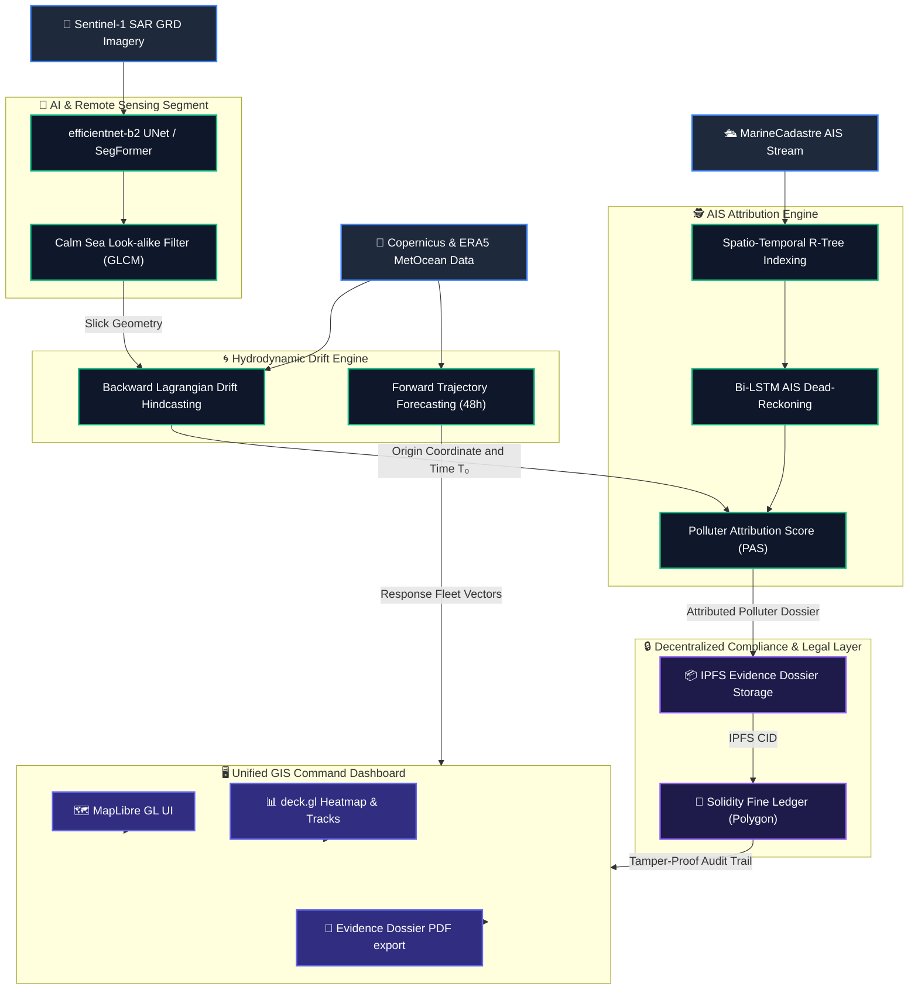

# 🌊 AegisOcean

[](https://github.com/Anany1014/AegisOcean)
[](https://opensource.org/licenses/MIT)
[](https://react.dev/)
[](https://tailwindcss.com/)
[](https://maplibre.org/)
[](https://polygon.technology/)
[](https://hardhat.org/)
[](https://pytorch.org/)
[](https://fastapi.tiangolo.com/)

> **Autonomous Satellite-SAR Oil Spill Detection, Hydrodynamic Hindcasting, AIS Culprit Attribution, and Smart-Contract Fine Enforcement System**

AegisOcean is an end-to-end maritime forensics and intelligence platform designed to automate the detection, tracking, culprit attribution, and legal enforcement of offshore oil discharges (deliberate maritime bilge washing and tanker spills).

---

## 1. Executive Summary & Problem-Solution Fit

### 📌 The Problem
Over **70% of marine oil discharges** go unpenalized globally due to three primary challenges:
1. **Shifting Baselines:** Oil slick origin points shift rapidly over time from wind, waves, and ocean currents.
2. **"Dark" Cooperating Vessels:** Polluting ship operators turn off their Automatic Identification System (AIS) transponders during illicit washings.
3. **Weak Chain of Custody:** Evidence package logs are frequently contested in international courts because there is no immutable, tamper-proof audit trail of telemetry data.

### 💡 The Solution: The Four-Phase Maritime Forensics Lifecycle
AegisOcean solves these vulnerabilities by integrating four continuous operations:
1. **📡 Detect & Segment:** Isolates oil slicks from Sentinel-1 Synthetic Aperture Radar (SAR) imagery while rejecting look-alike natural calm zones.
2. **🌀 Reverse Hindcast:** Executes backward Lagrangian hydrodynamic particle advection to pinpoint the exact time ($T_0$) and location ($X_0, Y_0$) coordinate of the spill.
3. **🕵️ AIS Correlation:** Matches ship tracks and dead-reckons AIS dropout gaps near the origin coordinate, scoring candidates with a multi-factor **Polluter Attribution Score (PAS)**.
4. **🔒 On-Chain Enforcement:** Pins evidence packages directly to IPFS/Filecoin and locks them under a statutory fine and port-clearance hold using smart contracts on Polygon.

---

## 2. End-to-End System Architecture



---

## 3. Project Directory Structure

```
SIH/
├── Frontend/                 # React 18 + Vite dashboard frontend application
│   ├── src/                  # Application source files
│   │   ├── app/              # Router shell and global providers
│   │   ├── features/         # Features (Map, Triage, Suspect, Dossier export)
│   │   ├── stores/           # Zustand client UI states (drift playback, theme)
│   │   └── ui/               # Shard token-driven design primitives
│   └── package.json          # Frontend packages & scripts
├── AegisOcean-repo/          # Sub-repository for blockchain components
│   └── blockchain/           # Hardhat development setup & API verification gateway
│       ├── contracts/        # MaritimeFineLedger.sol Solidarity contract
│       ├── services/         # IPFS (Pinata) and Contract integrations
│       ├── server.js         # Integration Express API controller
│       └── package.json      # Hardhat node dependencies & scripts
├── ml/                       # Python machine learning & remote sensing pipeline
│   ├── config.yaml           # Hyperparameters for neural classifiers
│   ├── run_pipeline.py       # Main ML execution pipeline (classify, evaluate)
│   ├── characterise.py       # Geometric properties & age estimator script
│   ├── ais_suspect.py        # Suspect vessel attribution matching
│   └── requirements_ml.txt   # Python ML modules
├── context/                  # Project specifications, designs, & rules
└── README.md                 # Project root documentation (this file)
```

---

## 4. Component Deep Dive

### 🧠 A. Machine Learning / Remote Sensing Image Segmentation (ML Track)
- **Data Ingestion:** Automatically consumes Ground Range Detected (GRD) Sentinel-1 C-band SAR radar imagery, calibrated to backscatter intensity ($\sigma^0$).
- **Filtering Noise:** Employs a **Refined-Lee speckle filter** ($7\times7$ window) to suppress speckles without losing slick boundary edges. Masking is applied to land regions using the GSHHG shoreline database.
- **Slick Segmentation:** Processes backscatter grids through a **SegFormer-B3** (or ResNet34-UNet) model to perform pixel-level segmentation on active discharges.
- **Look-alike Discrimination:** Overcomes biological films and calm ocean false alarms by combining Gray-Level Co-occurrence Matrix (**GLCM**) texture features (homogeneity and contrast metrics) with ERA5 weather wind data. Detections are rejected if local historical wind speeds fall below $2\text{ m/s}$ (calm look-alikes) or exceed $12\text{ m/s}$ (slick dispersion).

### 🌀 B. Hydrodynamic Drift & Hindcasting Engine
- **Physical Dynamics:** Follows Lagrangian advection kinetics:
  $$\vec{U}_{\text{drift}} = \vec{U}_{\text{ocean\_current}} + 0.03 \cdot \vec{U}_{\text{wind}} + \vec{U}_{\text{Stokes}}$$
- **Hindcasting (Reverse Simulation):** Spawns 5,000 inert virtual tracer particles inside the segmented oil slick boundary and simulates negative-time transport utilizing Copernicus current fields and ERA5 wind vectors up to $T_{-72\text{ hours}}$. The geographical point where the particle density is highest identifies the exact spill envelope coordinates $[T_0, (X_0, Y_0)]$.
- **Forecasting (Early Warning):** Projects forward ocean particle flow vector paths for $24\mbox{--}48\text{ h}$ to guide coast guard response fleets.

### 🕵️ C. AIS Vessel Anomaly & Attribution Core
- **R-Tree Indexing:** Queries marine tracking records (AIS) locally in real time across the spatial-temporal envelope window $[T_0 \pm \delta t]$ using R-Trees.
- **Dark Vessel Dead-Reckoning:** Interpolates probable location vectors for vessels whose transponders went dark (blackout anomaly) within range of the spill envelope.
- **Polluter Attribution Score (PAS) Equation:**
  $$\text{PAS}(v) = 0.40 \cdot S_{\text{dist}}(v) + 0.25 \cdot S_{\text{time}}(v) + 0.20 \cdot S_{\text{anomaly}}(v) + 0.15 \cdot S_{\text{type}}(v)$$
  *Where:*
  - $S_{\text{anomaly}}$ computes tracking anomalies (e.g. sharp speed reduction below 3 knots, zig-zag maneuvers, or AIS transmission blackout duration).
  - $S_{\text{type}}$ factors the vessel's registration class risk factor (e.g., crude tankers/chemical carriers receive top risk weight).

### 📜 D. Blockchain Compliance & Proof of Custody (Web3 Track)
- **Decentralized Storage:** Pins the generated incident dossier container (uncompressed geotiff imagery, segmented outlines in GeoJSON, trajectory vector logs, and PAS audit summaries) to **IPFS** (via Pinata) to establish a permanent Content Identifier (CID).
- **Legislation Ledger Smart Contract:**
  - Deployed on **Polygon Amoy Testnet** (`MaritimeFineLedger.sol` via Hardhat).
  - Stores incident metadata (`incidentId`, `suspectMMSI`, `ipfsCID`, `spillAreaSqKm`, `attributionScore`).
  - Computes statutory fines directly using MARPOL Annex I scales: $\text{Fine} = \text{Base Fine} + (\text{Slick Area} \times \text{Multiplier})$.
  - Triggers a `PortClearanceRevoked` event, communicating dynamic clearance holds to port authority registries.

### 🗺️ E. Unified GIS Control Command Center
- **GIS Layout Engine:** Combines React with MapLibre GL and deck.gl, configured with a comprehensive, thumbnail-driven Esri basemap gallery (World Ocean, Topographic, and Dark Canvas).
- **Forensic Time-Slider:** Interactive path matching allowing operators to scroll backward in time to align drifting particle clouds with candidate AIS tracks.
- **Cryptographic Evidence Verification:** Incorporates a one-click validation button calling the server API to compute and match the SHA-256 hash of the IPFS dataset against the on-chain Polygon anchor byte-for-byte.

---

## 🛠️ Installation & Setup

### Prerequisites
- Node.js (v18.x or later) & npm
- Python (3.10.x or later) & pip
- Hardhat toolchain (contained in `blockchain/` folder)

---

### Step 1: Initialize the Machine Learning Environment
Open a terminal shell and install Python requirements.

```bash
# Install dependencies
pip install -r ml/requirements_ml.txt

# Download the SOS dataset from Kaggle (Optional for pretraining)
kaggle datasets download bitsandlayers/sar-oil-spill-segmentation-dataset-sos
unzip sar-oil-spill-segmentation-dataset-sos.zip -d data/SOS
```

> [!NOTE]
> Training automatically selects the best available device: Apple Silicon (`mps`), CUDA GPUs, or falls back to CPU. You can adjust this configuration inside `ml/config.yaml`.

---

### Step 2: Initialize & Run the Hardhat Blockchain Backend
Navigate to the blockchain workspace, compile contracts, and start the signature gateway server.

```bash
# Navigate to blockchain directory
cd AegisOcean-repo/blockchain

# Install dependencies
npm install

# Compile the contract artifacts
npm run compile

# Launch the local Express signing/verification API server
npm start
```
*The API gateway and mock blockchain server will boot on port **`4000`** (`http://localhost:4000`).*

> [!TIP]
> If you have a live deployment target on the Polygon Amoy testnet, adjust the environment variables in a local `.env` file (`RPC_URL`, `PRIVATE_KEY`, `CONTRACT_ADDRESS`). Otherwise, the server automatically defaults to full functional **mock mode** for zero-setup demo scenarios.

---

### Step 3: Launch the React GIS Dashboard
Open a separate terminal window, set up frontend dependencies, and fire up Vite.

```bash
# Navigate to Frontend directory
cd Frontend

# Install package dependencies
npm install

# Start Vite Developer Hot Module Reloading server
npm run dev
```
*Open **`http://localhost:5173/`** in your browser to view the interactive AegisOcean Command Center.*

---

## 🛡️ License

This project is licensed under the MIT License. See the [LICENSE](LICENSE) file for more information.
