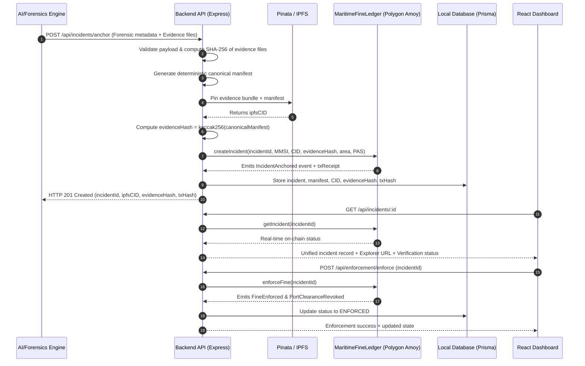

# AegisOcean — Backend Integration Plan

**Role:** Backend & Web3 Integration Engineer  
**Scope:** SIH MVP — Blockchain, IPFS, Evidence Anchoring, and Incident Enforcement  
**Document Version:** 1.0  
**Status:** Awaiting Approval  

---

## 1. Current Backend Architecture
- **Workspace State:** The current repository is a newly initialized workspace with a root `backend/` directory and project specification document (`sih2.pdf`).
- **Runtime Environment:**
  - **Node.js:** `v25.9.0`
  - **NPM:** `11.12.1`
  - **Python:** `3.14.4`
- **Framework & Language Selected:** TypeScript / Node.js with Express.js (or Fastify) for REST API services, utilizing `ethers.js` (v6) for EVM blockchain interactions and `@pinata/sdk` (or axios multipart Pinata pinning) for IPFS decentralized storage.

---

## 2. Existing APIs
- **Current State:** None currently active in the workspace (clean scaffold).
- **Baseline Design Requirement:** Complete REST API layer designed to interface directly between the upstream AI/Forensics pipeline, Pinata IPFS, the `MaritimeFineLedger` smart contract (Polygon Amoy / Sepolia testnet), and the React Command Dashboard.

---

## 3. Existing Database Structure
- **Current State:** No active database initialized in the local workspace.
- **MVP Database Strategy:** Lightweight, high-performance database setup:
  - **Option A (Lightweight MVP):** SQLite via Prisma ORM / `better-sqlite3` or lowdb for zero-overhead local development and demo portability.
  - **Option B (Standard Microservice):** PostgreSQL with Prisma ORM for structured relational records (incidents, vessel profiles, evidence manifests, fine enforcement records, transaction audit trails).
- **Prisma Schema Entities:**
  - `Incident`: Stores `incidentId` (UUID & bytes32), timestamps, area, MMSI, score, IPFS CID, evidenceHash, on-chain txHash, status.
  - `EvidenceManifest`: Stores JSON snapshot of satellite, AIS, drift hindcast vectors, and file hashes.
  - `FineRecord`: Stores statutory calculation parameters (`baseFine`, `multiplier`), calculated amount, currency, and settlement receipt.

---

## 4. Existing AI / Forensics Integration
- **Upstream Input Source:** AegisOcean AI/Forensics Pipeline.
- **Forensic Pipeline Outputs:**
  1. Sentinel-1 SAR oil spill segmentation raster/vector (`GeoTIFF` / `GeoJSON`).
  2. Hydrodynamic hindcast drift simulation vectors (origin coordinates and timestamp window).
  3. AIS vessel telemetry correlation slice.
  4. Polluter Attribution Score (PAS) ranking report.
- **Integration Ingress:**
  - HTTP `POST /api/incidents/anchor` accepting multipart/JSON payload containing the forensic package metadata and raw evidence artifacts.

---

## 5. Required New Backend Modules
1. **Evidence Bundling & IPFS Module (`services/ipfs.ts`):**
   - Normalizes input parameters.
   - Generates a deterministic canonical JSON evidence manifest.
   - Calculates SHA-256 hashes for all associated evidence files.
   - Pins the directory/files and manifest to Pinata IPFS; retrieves canonical IPFS CID.
   - Computes `evidenceHash` (`bytes32 keccak256` or `sha256` of canonical manifest).
2. **Blockchain Service Module (`services/blockchain.ts`):**
   - Ethers.js v6 provider and server-side private key wallet signer.
   - Interfaces with `MaritimeFineLedger.sol` on Polygon Amoy / Ethereum Sepolia.
   - Functions: `createIncident`, `enforceFine`, `recordFineSettlement`, `releasePortClearance`, `getIncident`, `getFineParameters`.
   - Listens to smart contract events: `IncidentAnchored`, `FineEnforced`, `PortClearanceRevoked`, `FineSettled`, `PortClearanceReleased`.
3. **Fine Calculation Engine (`services/fineEngine.ts`):**
   - Implements statutory model: $\text{Fine} = \text{baseFine} + (\text{spillAreaSqKm} \times \text{areaMultiplier})$.
   - Configurable parameters fetched from contract/env to ensure reproducible, deterministic results.
4. **Validation & Verification Service (`services/verifier.ts`):**
   - Verification endpoint to prove evidence integrity: pulls bundle from IPFS, recalculates canonical manifest hash, compares against on-chain `evidenceHash` (`MATCH` / `MISMATCH`).
5. **REST API Controllers & Routers (`routes/incidents.ts`, `routes/blockchain.ts`, `routes/enforcement.ts`).**

---

## 6. Files That Should Be Created

```text
backend/
├── package.json
├── tsconfig.json
├── .env.example
├── src/
│   ├── index.ts                      # Express app entrypoint & server bootstrap
│   ├── config/
│   │   ├── env.ts                    # Zod/dotenv environment configuration
│   │   └── chain.ts                  # RPC, Contract Address, ABIs, Wallet setup
│   ├── contracts/
│   │   └── MaritimeFineLedger.json   # Contract ABI artifact
│   ├── controllers/
│   │   ├── incident.controller.ts    # Handlers for incident creation, queries, verification
│   │   └── enforcement.controller.ts # Handlers for fine enforcement, settlement, clearance
│   ├── routes/
│   │   ├── index.ts                  # Router aggregator
│   │   ├── incident.routes.ts        # /api/incidents routes
│   │   └── enforcement.routes.ts     # /api/enforcement routes
│   ├── services/
│   │   ├── ipfs.service.ts           # Pinata upload, manifest generation, hashing
│   │   ├── blockchain.service.ts     # Contract interaction via ethers.js (Attestor & Enforcement)
│   │   ├── fine.service.ts           # Statutory fine calculation logic
│   │   └── verification.service.ts   # Canonical hash re-computation & on-chain check
│   ├── models/                       # Database models / Prisma client
│   │   └── prisma.ts                 # Prisma client instance
│   ├── types/
│   │   ├── incident.types.ts         # TypeScript interfaces for forensic payload, manifest, status
│   │   └── blockchain.types.ts       # Event and contract transaction types
│   ├── middleware/
│   │   ├── errorHandler.ts           # Standardized API error responses
│   │   ├── validateRequest.ts        # Request payload validation middleware (Zod)
│   │   └── auth.ts                   # Role-based API authentication (Bearer token/API key)
│   └── utils/
│       ├── crypto.ts                 # Deterministic JSON canonicalization & SHA256/Keccak256
│       └── logger.ts                 # Structured logging (Winston / Pino)
├── prisma/
│   └── schema.prisma                 # Database schema definition
└── tests/
    ├── ipfs.test.ts                  # Manifest generation and IPFS mock tests
    ├── blockchain.test.ts            # Contract read/write integration tests
    └── incident.api.test.ts          # End-to-end API route tests
```

---

## 7. Files That Should Be Modified
- `backend-integration-plan.md` (updated upon iteration)
- `.gitignore` (ensure `.env`, `node_modules`, `dist/`, `.turbo/`, database binaries are ignored)

---

## 8. API Design

### A. Incidents & Forensics Ingress
- **`POST /api/incidents/anchor`**
  - **Role:** Evidence Attestor (Authorized AI/Forensics pipeline service)
  - **Payload:**
    ```json
    {
      "incidentId": "INC-20260831-001",
      "sourceSatellite": "Sentinel-1A SAR",
      "sceneId": "S1A_IW_GRDH_1SDV_20260831T181204",
      "detectionTimestamp": 1788201124,
      "spillAreaSqKm": 14.85,
      "originTimeWindow": { "start": 1788190000, "end": 1788198000 },
      "originCoordinates": { "latitude": 18.924, "longitude": 72.835 },
      "suspectMMSI": 413298410,
      "attributionScore": 92.5,
      "driftModelVersion": "OpenDrift-v2.1",
      "files": [
        { "name": "sar_slick_segmentation.geojson", "contentBase64": "..." },
        { "name": "ais_trajectory_slice.csv", "contentBase64": "..." },
        { "name": "pas_report.pdf", "contentBase64": "..." }
      ]
    }
    ```
  - **Actions:**
    1. Form canonical manifest & hash individual files with SHA-256.
    2. Pin bundle + manifest to Pinata IPFS $\to$ get `ipfsCID`.
    3. Compute `evidenceHash` (`bytes32`).
    4. Call smart contract `createIncident(incidentIdBytes32, suspectMMSI, ipfsCID, evidenceHash, spillAreaScaled, attributionScoreScaled)`.
    5. Save locally in database with `txHash`, block number, and status `Anchored`.
  - **Response:**
    ```json
    {
      "success": true,
      "incidentId": "INC-20260831-001",
      "incidentIdBytes32": "0x494e432d32303236303833312d30303100000000000000000000000000000000",
      "ipfsCID": "QmZtmD2qtWBSnp...canonicalCID",
      "evidenceHash": "0x7f83b1657ff1fc53b92dc18148a1d65dfc2d4b1fa3d677284addd200126d9069",
      "txHash": "0x9e31...abc",
      "explorerUrl": "https://amoy.polygonscan.com/tx/0x9e31...abc",
      "status": "Anchored"
    }
    ```

- **`GET /api/incidents/:id`**
  - Combines local database metadata + real-time on-chain state from `MaritimeFineLedger.getIncident(id)`.
  - Returns unified JSON with IPFS CID, evidenceHash, suspect MMSI, fine amount, port clearance state, and explorer links.

- **`POST /api/incidents/:id/verify`**
  - Verification check: fetches manifest from IPFS gateway, calculates SHA-256/Keccak-256 hash, and compares against contract `evidenceHash`.
  - Response: `{ "verified": true, "result": "MATCH", "evidenceHash": "0x...", "onChainHash": "0x..." }`.

### B. Legal Enforcement & Settlement
- **`POST /api/enforcement/enforce`**
  - **Role:** Enforcement Authority
  - **Payload:** `{ "incidentId": "INC-20260831-001" }`
  - **Action:** Triggers `MaritimeFineLedger.enforceFine(incidentIdBytes32)`. Emits `FineEnforced` and `PortClearanceRevoked`.
  - **Response:** `{ "status": "Enforced", "fineAmount": 55000, "clearanceStatus": "REVOKED", "txHash": "0x..." }`

- **`POST /api/enforcement/settle`**
  - **Role:** Enforcement Authority / Payment Gateway
  - **Payload:** `{ "incidentId": "INC-20260831-001", "paymentReceipt": "REF-99812" }`
  - **Action:** Triggers `MaritimeFineLedger.recordFineSettlement(incidentIdBytes32)` and optionally `releasePortClearance(incidentIdBytes32)`.
  - **Response:** `{ "status": "Settled", "clearanceStatus": "RELEASED", "txHash": "0x..." }`

- **`GET /api/blockchain/status`**
  - Returns network name, chain ID, connected RPC status, contract address, current gas price, and attestor wallet address & balance.

---

## 9. Database Changes Required

### Prisma Schema (`schema.prisma`):
```prisma
datasource db {
  provider = "sqlite" // or "postgresql"
  url      = env("DATABASE_URL")
}

generator client {
  provider = "prisma-client-js"
}

enum IncidentStatus {
  ANCHORED
  ENFORCED
  SETTLED
  RELEASED
}

model Incident {
  id                 String         @id @default(uuid())
  incidentId         String         @unique
  incidentIdBytes32  String         @unique
  sourceSatellite    String
  sceneId            String
  detectionTimestamp DateTime
  spillAreaSqKm      Float
  originLat          Float
  originLon          Float
  suspectMMSI        BigInt
  attributionScore   Float
  ipfsCID            String
  evidenceHash       String
  fineAmount         Float?
  status             IncidentStatus @default(ANCHORED)
  anchorTxHash       String
  enforceTxHash      String?
  settleTxHash       String?
  createdAt          DateTime       @default(now())
  updatedAt          DateTime       @updatedAt
  manifest           EvidenceManifest?
}

model EvidenceManifest {
  id            String   @id @default(uuid())
  incidentId    String   @unique
  incident      Incident @relation(fields: [incidentId], references: [incidentId])
  canonicalJson String
  fileManifest  String   // JSON list of file names and SHA-256 hashes
  createdAt     DateTime @default(now())
}
```

---

## 10. IPFS Integration Point
- **Provider:** Pinata IPFS (`https://api.pinata.cloud` / `@pinata/sdk`).
- **Mechanism:**
  1. Input bundle files (GeoJSON, AIS slice, PAS report) are digested using SHA-256.
  2. Canonical Manifest JSON is constructed with deterministic key sorting.
  3. `pinJSONToIPFS` or `pinDirectoryToPinata` is executed.
  4. Returns `ipfsCID` (e.g., `Qm...` / `bafy...`).
  5. SHA-256 / Keccak-256 hash of canonical manifest is produced as `evidenceHash` for on-chain anchoring.

---

## 11. Blockchain Integration Point
- **Smart Contract:** `MaritimeFineLedger.sol` (Solidity `^0.8.24`)
- **Networks:** Polygon Amoy Testnet (ChainID `80002`) / Ethereum Sepolia (ChainID `11155111`).
- **Integration Library:** `ethers.js` v6.
- **Backend Role & Wallet Management:**
  - `EVIDENCE_ATTESTOR_PRIVATE_KEY`: Server-side dedicated signer for incident registration.
  - `ENFORCEMENT_AUTHORITY_PRIVATE_KEY`: Separate role key or multi-role signer for fine enforcement and port clearance state mutations.
- **Contract Interface Integration:**
  ```solidity
  function createIncident(
      bytes32 incidentId,
      uint64 suspectMMSI,
      string calldata ipfsCID,
      bytes32 evidenceHash,
      uint256 spillAreaSqKm,
      uint256 attributionScore
  ) external returns (bytes32);

  function enforceFine(bytes32 incidentId) external;
  function recordFineSettlement(bytes32 incidentId) external;
  function releasePortClearance(bytes32 incidentId) external;
  function getIncident(bytes32 incidentId) external view returns (IncidentView memory);
  ```

---

## 12. Complete Data Flow



---

## 13. Environment Variables Required

Create `.env` (with corresponding `.env.example`):
```ini
# Server Configuration
PORT=4000
NODE_ENV=development
CORS_ORIGIN=http://localhost:3000,http://localhost:5173

# Database
DATABASE_URL="file:./dev.db"

# Blockchain Configuration (Polygon Amoy / Sepolia)
RPC_URL=https://rpc-amoy.polygon.technology
CHAIN_ID=80002
CONTRACT_ADDRESS=0x0000000000000000000000000000000000000000
BLOCK_EXPLORER_URL=https://amoy.polygonscan.com

# Server-Side Blockchain Signers (DO NOT EXPOSE TO FRONTEND)
ATTESTOR_PRIVATE_KEY=0x...
ENFORCEMENT_PRIVATE_KEY=0x...

# IPFS / Pinata Credentials
PINATA_API_KEY=your_pinata_api_key
PINATA_API_SECRET=your_pinata_api_secret
PINATA_JWT=your_pinata_jwt
IPFS_GATEWAY=https://gateway.pinata.cloud/ipfs/

# Statutory Fine Defaults (Fallback / Calculation parameters)
DEFAULT_BASE_FINE_MATIC=1000
DEFAULT_AREA_MULTIPLIER_MATIC=500
```

---

## 14. Risks and Assumptions

### Risks:
1. **Network Congestion / Gas Fluctuations:** Testnet RPC timeouts or sudden gas spikes during incident anchoring.
   - *Mitigation:* Implement transaction retry logic with exponential backoff and dynamic EIP-1559 gas fee estimation.
2. **IPFS Pinning Latency / Gateway Availability:** Gateway rate-limiting when resolving forensic bundles for verification.
   - *Mitigation:* Cache IPFS manifests locally and query fallback gateways (`ipfs.io`, `cloudflare-ipfs.com`).
3. **Private Key Security:** Accidental leakage of privileged attestor/enforcement private keys.
   - *Mitigation:* Sign transactions exclusively on the backend; never pass keys to client/frontend; load via environment variables.

### Assumptions:
1. **Integer Precision:** On-chain numeric values (e.g., `spillAreaSqKm` with 2 decimals, PAS score $0.00-100.00$) will be scaled by standard multipliers ($10^2$ or $10^4$) to prevent floating-point inaccuracies in Solidity.
2. **Deterministic IDs:** `incidentId` strings are normalized and converted to `bytes32` via `ethers.encodeBytes32String` or `keccak256` for gas-efficient mapping keys.
3. **AI Pipeline Separation:** AI models run independently; they submit structured forensic conclusions to the backend for human/authority attestation before blockchain write.

---
**Summary:** This plan provides the complete blueprint for the AegisOcean backend service, seamlessly linking the AI/Forensics pipeline, IPFS decentralized storage, `MaritimeFineLedger` smart contract, and the React command dashboard.
