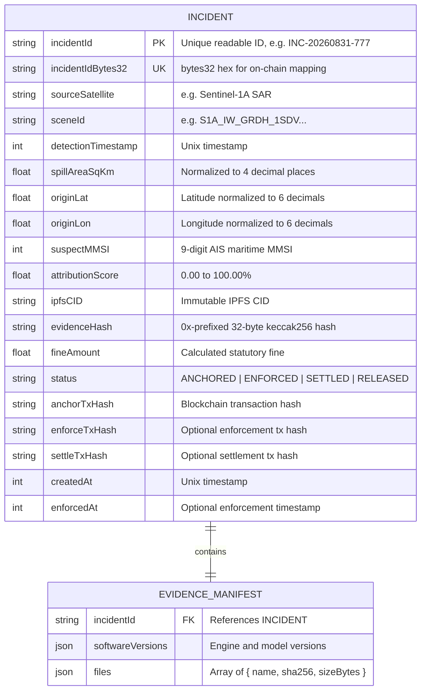
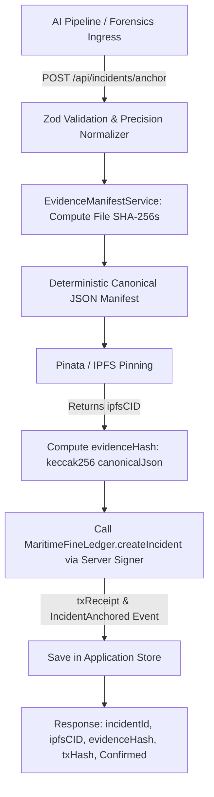
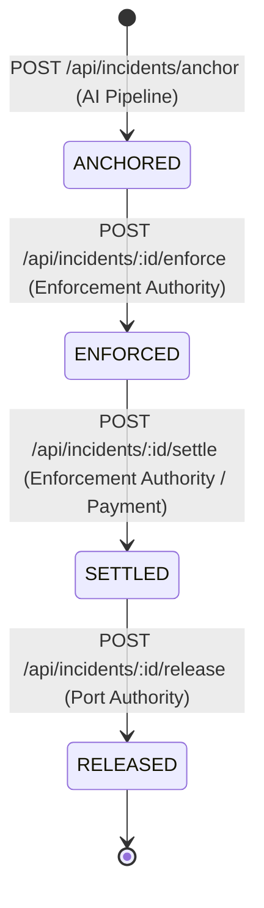

# AegisOcean — Backend API Specification & Architecture Guide

**Service:** AegisOcean Backend Service  
**Version:** 1.0.0 (SIH MVP)  
**Protocol:** REST / JSON  
**Base URL:** `http://localhost:4000/api`  
**Blockchain Target:** Polygon Amoy Testnet (Chain ID `80002`) / Ethereum Sepolia (Chain ID `11155111`)  
**Smart Contract:** `MaritimeFineLedger.sol`  

---

## 1. Overview & Architecture

AegisOcean combines Sentinel-1 SAR oil slick segmentation, hydrodynamic drift hindcasting, and AIS telemetry correlation to identify maritime polluters. The backend service acts as the cryptographic bridge:
1. Ingests AI forensic outputs and raw telemetry artifacts.
2. Normalizes numerical precision and synthesizes a deterministic canonical JSON evidence manifest.
3. Pins the evidence bundle to **IPFS via Pinata** and receives an immutable `ipfsCID`.
4. Computes `evidenceHash` (`bytes32 keccak256`) representing the cryptographic commitment.
5. Anchors the incident onto the **`MaritimeFineLedger` smart contract** using server-side signers.
6. Enforces statutory fines, processes settlements, and releases maritime port-clearance locks through role-authorized APIs.
7. Continuously synchronizes on-chain events (`IncidentAnchored`, `FineEnforced`, `PortClearanceRevoked`, `FineSettled`, `PortClearanceReleased`).

---

## 2. API Endpoints

### 2.1 POST `/api/incidents/anchor`
- **Purpose:** Ingests forensic incident data from the AI pipeline, generates a canonical evidence manifest, pins the package to IPFS, computes the `evidenceHash`, anchors the incident onto `MaritimeFineLedger`, and persists the record.
- **Authentication:** Public / Internal Pipeline Service (Optional `x-api-key`).
- **Authorization:** `EVIDENCE_ATTESTOR` / `ADMIN`.
- **Request Parameters:** None.
- **Request Body:**
  ```json
  {
    "incidentId": "INC-20260831-777",
    "sourceSatellite": "Sentinel-1A SAR",
    "sceneId": "S1A_IW_GRDH_1SDV_20260831T181204",
    "detectionTimestamp": 1788201124,
    "spillAreaSqKm": 14.8543,
    "originTimeWindow": {
      "start": 1788190000,
      "end": 1788198000
    },
    "originCoordinates": {
      "latitude": 18.924157,
      "longitude": 72.835492
    },
    "driftModelVersion": "OpenDrift-v2.1",
    "AISDataRange": "1788190000-1788198000",
    "suspectMMSI": 413298410,
    "attributionScore": 92.55,
    "softwareVersions": {
      "hydrodynamicEngine": "OpenDrift-v2.1",
      "sarSegmentation": "AegisOcean-UNet-v1.4",
      "aisEngine": "AegisCorrelator-v1.0"
    },
    "files": [
      {
        "name": "sar_slick_segmentation.geojson",
        "contentBase64": "eyJ0eXBlIjoiRmVhdHVyZUNvbGxlY3Rpb24iLCJmZWF0dXJlcyI6W119",
        "mimeType": "application/geo+json"
      },
      {
        "name": "ais_telemetry_slice.csv",
        "contentBase64": "dGltZXN0YW1wLG1tc2ksbGF0LGxvbgoyMDI2LTA4LTMxVDE4OjAwOjAwWiw0MTMyOTg0MTAsMTguOTIsNzIuODM=",
        "mimeType": "text/csv"
      }
    ]
  }
  ```
- **Response (201 Created):**
  ```json
  {
    "success": true,
    "data": {
      "incidentId": "INC-20260831-777",
      "ipfsCID": "bafybeic774e8ec59ed072344e728af50a110701874a6540883db05c24d",
      "evidenceHash": "0x961effdec003ef3f1d13d350a0c9adc35a080e0cbf961466aeeb9c7b8a99fe07",
      "txHash": "0x4fe67ad3a14e9f731215b248a3e728a478912e7314562098b1a80c98f7123456",
      "confirmationStatus": "Confirmed",
      "status": "Anchored",
      "incidentIdBytes32": "0x494e432d32303236303833312d37373700000000000000000000000000000000",
      "fineAmount": 8427.15,
      "blockNumber": 15420912,
      "explorerUrl": "https://amoy.polygonscan.com/tx/0x4fe67ad3a14e9f731215b248a3e728a478912e7314562098b1a80c98f7123456",
      "incident": {
        "incidentId": "INC-20260831-777",
        "suspectMMSI": 413298410,
        "spillAreaSqKm": 14.8543,
        "attributionScore": 92.55,
        "status": "ANCHORED",
        "createdAt": 1788201125
      }
    }
  }
  ```
- **Error Responses:**
  - `400 Bad Request`: Missing fields, out-of-range coordinates ($|\text{lat}| > 90$, $|\text{lon}| > 180$), invalid 9-digit MMSI, negative area.
  - `409 Conflict`: Incident ID already registered with differing forensic evidence.
  - `502 Bad Gateway`: IPFS pinning failure (aborts before blockchain write).
  - `500 Internal Server Error`: Smart contract execution error during on-chain anchoring.

---

### 2.2 GET `/api/incidents/:id`
- **Purpose:** Retrieves the full incident record, metadata, manifest breakdown, and transaction references from the database.
- **Authentication:** None (Public Dashboard / Inspector).
- **Authorization:** `PUBLIC_VIEWER`, `ENFORCEMENT_AUTHORITY`, `ADMIN`.
- **Request Parameters:**
  - `id` (path, string): Unique Incident ID (e.g. `INC-20260831-777`).
- **Request Body:** None.
- **Response (200 OK):**
  ```json
  {
    "success": true,
    "data": {
      "incidentId": "INC-20260831-777",
      "incidentIdBytes32": "0x494e432d32303236303833312d37373700000000000000000000000000000000",
      "sourceSatellite": "Sentinel-1A SAR",
      "sceneId": "S1A_IW_GRDH_1SDV_20260831T181204",
      "detectionTimestamp": 1788201124,
      "spillAreaSqKm": 14.8543,
      "originCoordinates": {
        "latitude": 18.924157,
        "longitude": 72.835492
      },
      "suspectMMSI": 413298410,
      "attributionScore": 92.55,
      "ipfsCID": "bafybeic774e8ec59ed072344e728af50a110701874a6540883db05c24d",
      "evidenceHash": "0x961effdec003ef3f1d13d350a0c9adc35a080e0cbf961466aeeb9c7b8a99fe07",
      "fineAmount": 8427.15,
      "status": "ANCHORED",
      "anchorTxHash": "0x4fe67ad3a14e9f731215b248a3e728a478912e7314562098b1a80c98f7123456",
      "createdAt": 1788201125,
      "manifest": {
        "incidentId": "INC-20260831-777",
        "softwareVersions": {
          "hydrodynamicEngine": "OpenDrift-v2.1",
          "sarSegmentation": "AegisOcean-UNet-v1.4",
          "aisEngine": "AegisCorrelator-v1.0"
        },
        "files": [
          { "name": "ais_telemetry_slice.csv", "sha256": "4b227777d4da1fc...", "sizeBytes": 128 },
          { "name": "sar_slick_segmentation.geojson", "sha256": "ef2d127391...", "sizeBytes": 420 }
        ]
      }
    }
  }
  ```
- **Error Responses:**
  - `404 Not Found`: Incident not found in database.
  - `400 Bad Request`: Invalid incident ID format.

---

### 2.3 POST `/api/incidents/:id/enforce`
- **Purpose:** Authorized legal enforcement action. Submits `enforceFine(bytes32)` to `MaritimeFineLedger.sol`, emits `FineEnforced` and `PortClearanceRevoked` events, and transitions the state from `ANCHORED` to `ENFORCED`.
- **Authentication:** `x-api-key: <ENFORCEMENT_API_KEY>` or `Authorization: Bearer <ENFORCEMENT_API_KEY>`.
- **Authorization:** `ENFORCEMENT_AUTHORITY` or `ADMIN`.
- **Request Parameters:**
  - `id` (path, string): Unique Incident ID.
- **Request Body:** None.
- **Example Request:**
  ```http
  POST /api/incidents/INC-20260831-777/enforce HTTP/1.1
  Host: localhost:4000
  x-api-key: aegis-enforcement-auth-key-2026
  ```
- **Response (200 OK):**
  ```json
  {
    "success": true,
    "message": "Fine enforced and port-clearance revocation event confirmed on-chain",
    "data": {
      "incidentId": "INC-20260831-777",
      "incidentIdBytes32": "0x494e432d32303236303833312d37373700000000000000000000000000000000",
      "status": "ENFORCED",
      "txHash": "0xe1e2e3e4e5e6e1e2e3e4e5e6e1e2e3e4e5e6e1e2e3e4e5e6e1e2e3e4e5e60200",
      "blockNumber": 15420915,
      "explorerUrl": "https://amoy.polygonscan.com/tx/0xe1e2e3e4e5e6...",
      "fineAmount": 8427.15,
      "clearanceStatus": "REVOKED"
    }
  }
  ```
- **Error Responses:**
  - `401 Unauthorized`: Missing or invalid API key / token.
  - `403 Forbidden`: Caller role is not authorized for legal enforcement.
  - `404 Not Found`: Incident not found.
  - `409 Conflict`: Invalid state transition (incident is not in `ANCHORED` status).

---

### 2.4 POST `/api/incidents/:id/settle`
- **Purpose:** Records fine payment settlement on `MaritimeFineLedger.sol`, emits `FineSettled`, and transitions state from `ENFORCED` to `SETTLED`.
- **Authentication:** `x-api-key: <ENFORCEMENT_API_KEY>` or `Authorization: Bearer <ENFORCEMENT_API_KEY>`.
- **Authorization:** `ENFORCEMENT_AUTHORITY` or `ADMIN`.
- **Request Parameters:**
  - `id` (path, string): Unique Incident ID.
- **Request Body (Optional):**
  ```json
  {
    "paymentReceipt": "RECEIPT-POL-2026-99128"
  }
  ```
- **Response (200 OK):**
  ```json
  {
    "success": true,
    "message": "Fine settlement confirmed on-chain",
    "data": {
      "incidentId": "INC-20260831-777",
      "incidentIdBytes32": "0x494e432d32303236303833312d37373700000000000000000000000000000000",
      "status": "SETTLED",
      "txHash": "0xf1f2f3f4f5f6f1f2f3f4f5f6f1f2f3f4f5f6f1f2f3f4f5f6f1f2f3f4f5f60300",
      "blockNumber": 15420920,
      "explorerUrl": "https://amoy.polygonscan.com/tx/0xf1f2f3f4f5f6...",
      "fineAmount": 8427.15,
      "clearanceStatus": "REVOKED"
    }
  }
  ```
- **Error Responses:**
  - `401 Unauthorized`: Unauthenticated request.
  - `403 Forbidden`: Insufficient role.
  - `404 Not Found`: Incident not found.
  - `409 Conflict`: Invalid state transition (incident is not in `ENFORCED` status).

---

### 2.5 POST `/api/incidents/:id/release`
- **Purpose:** Releases the maritime port-clearance revocation on `MaritimeFineLedger.sol` following fine settlement, emits `PortClearanceReleased`, and transitions state from `SETTLED` to `RELEASED`.
- **Authentication:** `x-api-key: <ENFORCEMENT_API_KEY>` or `Authorization: Bearer <ENFORCEMENT_API_KEY>`.
- **Authorization:** `ENFORCEMENT_AUTHORITY` or `ADMIN`.
- **Request Parameters:**
  - `id` (path, string): Unique Incident ID.
- **Request Body:** None.
- **Response (200 OK):**
  ```json
  {
    "success": true,
    "message": "Port clearance released and confirmed on-chain",
    "data": {
      "incidentId": "INC-20260831-777",
      "incidentIdBytes32": "0x494e432d32303236303833312d37373700000000000000000000000000000000",
      "status": "RELEASED",
      "txHash": "0xc1c2c3c4c5c6c1c2c3c4c5c6c1c2c3c4c5c6c1c2c3c4c5c6c1c2c3c4c5c60400",
      "blockNumber": 15420925,
      "explorerUrl": "https://amoy.polygonscan.com/tx/0xc1c2c3c4c5c6...",
      "fineAmount": 8427.15,
      "clearanceStatus": "RELEASED"
    }
  }
  ```
- **Error Responses:**
  - `401 Unauthorized`: Unauthenticated request.
  - `403 Forbidden`: Insufficient role permissions.
  - `409 Conflict`: Cannot release port clearance before fine is settled (must be in `SETTLED` status).

---

### 2.6 GET `/api/incidents/:id/verify-evidence`
- **Purpose:** Audits and verifies the complete cryptographic chain of custody for an incident: fetches the evidence bundle from IPFS, recalculates the canonical manifest hash, fetches the on-chain hash from `MaritimeFineLedger.sol`, and returns `MATCH` or `MISMATCH`.
- **Authentication:** None (Public Verification / Port Authority Tooling).
- **Authorization:** Public.
- **Request Parameters:**
  - `id` (path, string): Unique Incident ID.
- **Request Body:** None.
- **Response (200 OK — Match):**
  ```json
  {
    "success": true,
    "data": {
      "incidentId": "INC-20260831-777",
      "ipfsCID": "bafybeic774e8ec59ed072344e728af50a110701874a6540883db05c24d",
      "calculatedEvidenceHash": "0x961effdec003ef3f1d13d350a0c9adc35a080e0cbf961466aeeb9c7b8a99fe07",
      "onChainEvidenceHash": "0x961effdec003ef3f1d13d350a0c9adc35a080e0cbf961466aeeb9c7b8a99fe07",
      "result": "MATCH",
      "verified": true,
      "timestamp": "2026-08-31T17:36:15.123Z"
    }
  }
  ```
- **Response (200 OK — Mismatch / Tampered):**
  ```json
  {
    "success": true,
    "data": {
      "incidentId": "INC-20260831-777",
      "ipfsCID": "bafybeic774e8ec59ed072344e728af50a110701874a6540883db05c24d",
      "calculatedEvidenceHash": "0x1111111111111111111111111111111111111111111111111111111111111111",
      "onChainEvidenceHash": "0x961effdec003ef3f1d13d350a0c9adc35a080e0cbf961466aeeb9c7b8a99fe07",
      "result": "MISMATCH",
      "verified": false,
      "timestamp": "2026-08-31T17:36:15.123Z"
    }
  }
  ```
- **Error Responses:**
  - `404 Not Found`: Incident not found in records.

---

## 3. Environment Variables

| Variable | Type | Description | Default / Example |
| :--- | :--- | :--- | :--- |
| `PORT` | `number` | Express HTTP server port | `4000` |
| `NODE_ENV` | `string` | Runtime environment (`development`, `production`, `test`) | `development` |
| `CORS_ORIGIN` | `string` | Permitted CORS origins | `http://localhost:3000,http://localhost:5173` |
| `BLOCKCHAIN_RPC_URL` / `RPC_URL` | `url` | EVM JSON-RPC provider URL | `https://rpc-amoy.polygon.technology` |
| `CHAIN_ID` | `number` | Target network chain ID | `80002` (Amoy) / `11155111` (Sepolia) |
| `MARITIME_FINE_LEDGER_ADDRESS` / `CONTRACT_ADDRESS` | `address` | Deployed `MaritimeFineLedger.sol` contract address | `0x0000000000000000000000000000000000000000` |
| `BLOCK_EXPLORER_URL` | `url` | Block explorer base URL | `https://amoy.polygonscan.com` |
| `BLOCKCHAIN_PRIVATE_KEY` / `ATTESTOR_PRIVATE_KEY` | `hex` | Server-side private key for Evidence Attestor | `0x...` (Never exposed to client) |
| `ENFORCEMENT_PRIVATE_KEY` | `hex` | Server-side private key for Enforcement Authority | `0x...` (Never exposed to client) |
| `ENFORCEMENT_API_KEY` | `string` | API Key for enforcement route authentication | `aegis-enforcement-auth-key-2026` |
| `ATTESTOR_API_KEY` | `string` | API Key for forensic pipeline authentication | `aegis-evidence-attestor-key-2026` |
| `ADMIN_API_KEY` | `string` | API Key for administrative operations | `aegis-admin-key-2026` |
| `PINATA_API_KEY` | `string` | Pinata IPFS API Key | Optional in test / mock mode |
| `PINATA_SECRET_KEY` / `PINATA_API_SECRET` | `string` | Pinata IPFS Secret Key | Optional in test / mock mode |
| `PINATA_JWT` | `string` | Pinata IPFS JWT Bearer Token | Optional in test / mock mode |
| `IPFS_GATEWAY` | `url` | IPFS resolution gateway | `https://gateway.pinata.cloud/ipfs/` |
| `DEFAULT_BASE_FINE` | `number` | Fallback base statutory fine (testnet POL) | `1000` |
| `DEFAULT_AREA_MULTIPLIER` | `number` | Fallback area multiplier ($\text{POL}/\text{km}^2$) | `500` |

---

## 4. Database Model

The database maintains incident records, canonical manifests, and blockchain audit histories:



---

## 5. IPFS & Blockchain Flow



---

## 6. Blockchain Event Synchronization

The [`BlockchainEventSyncService`](file:///c:/Users/Ojaswini/aegisocean/backend/src/services/eventSync.service.ts) runs continuously in the background:
- **Event Binding**: Listens to `IncidentAnchored`, `FineEnforced`, `PortClearanceRevoked`, `FineSettled`, `PortClearanceReleased`.
- **Idempotency Guard**: Tracks processed events via `${eventType}:${txHash}:${logIndex}:${incidentId}` to prevent duplicate processing on chain reorganizations or polling duplicates.
- **Auto-Reconnection**: Reconnects automatically using exponential backoff ($1\text{s} \to 30\text{s}$) upon RPC connection loss.

---

## 7. Incident Lifecycle State Machine



- **Statutory Fine Model**:
  $$\text{Fine Amount} = \text{baseFine} + (\text{spillAreaSqKm} \times \text{areaMultiplier})$$
- **Port Clearance State**:
  - `ANCHORED`: Standard clearance.
  - `ENFORCED`: Port clearance **REVOKED** (`PortClearanceRevoked` emitted).
  - `SETTLED`: Fine satisfied; clearance remains locked until explicit release.
  - `RELEASED`: Port clearance **RELEASED** (`PortClearanceReleased` emitted).
